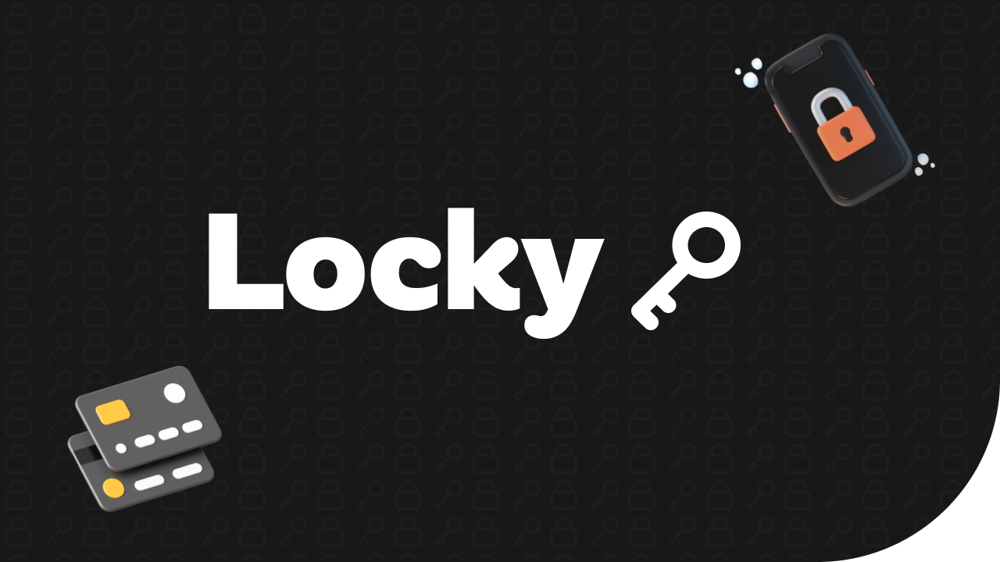
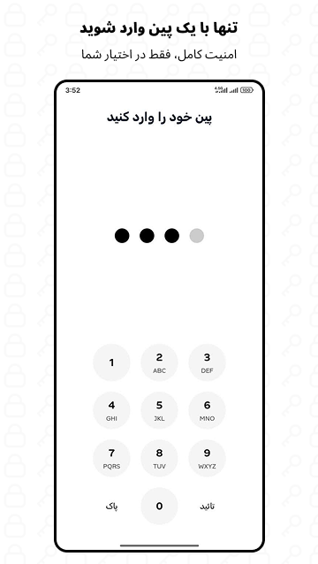
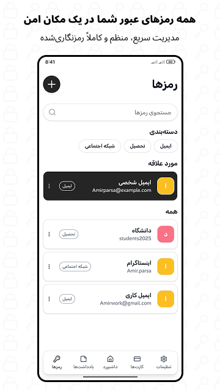
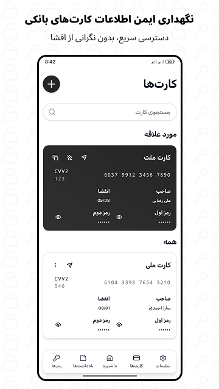
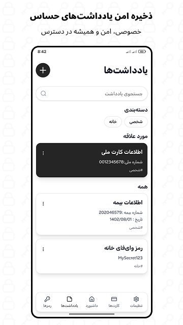

  

<h1 align="center">🔐 Locky</h1>

  A secure, client-side personal information management with end-to-end encryption and full privacy.

---

## 📄 Description

**Locky** is a secure and modern password manager that stores all your sensitive data locally and encrypted on your device. No servers, no tracking, full privacy and control.

---

## ✨ Features

- 🔐 **End-to-end encryption** derived from the user’s PIN  
- 📝 Secure storage for passwords, sensitive notes, and credit card data  
- 📤 Export and import of encrypted backups for device-to-device transfer  
- 🌐 Fully offline — no internet, no external connection  
- 📲 Clean, modern UI with intuitive experience

---

## 🧰 Technologies Used

- ⚛️ **React 19** — for building the user interface  
- 🌐 **Ionic React** — to create a mobile-like experience  
- 📱 **Capacitor** — to wrap the web app into an Android APK  
- ⚡ **Vite** — for fast development and build  
- 🎨 **Tailwind CSS** — for styling  
- 🌍 **i18next** — for multilingual support  
- 🧠 **Zustand** — lightweight state management  
- 🌀 **Framer Motion** — smooth animations  
- 📦 **Capacitor Plugins** (Filesystem, Preferences, Share, StatusBar) — to access native device features

---

## 📸 Screenshots

  
  
  
  

---

## 📥 Download

You can download the official Locky app from Myket:

- Myket: [Download Locky](https://myket.ir/app/com.lockyapp.main)

Or download the APK directly from this repository:

- GitHub Releases: [Download latest APK](https://github.com/Camynull/Locky/releases/latest)

## 🔐 Security Considerations

- All data is stored **locally on your device**, encrypted at rest.  
- No external servers or APIs are used — everything runs **client-side**.  
- Encryption is derived from the user’s PIN and never leaves the device.  
- Backup exports are **encrypted**, so only your app instance (with correct PIN) can decrypt them.

---

## ℹ️ Details

- 📱 **Platform:** Android  
- 🌐 **Published:** Available on Myket  
- 📅 **Last Updated:** October 2025  

---

## 👤 Developer

**Camynull**  
Fullstack & Mobile Developer

- GitHub: [Camynull](https://github.com/Camynull)  
- Email: [camynull@gmail.com](mailto:camynull@gmail.com)

---

### ⚠️ License & Source Policy

The source code of this project is **not publicly released** for security reasons.  
Only the official APK version is available for use by end users.

